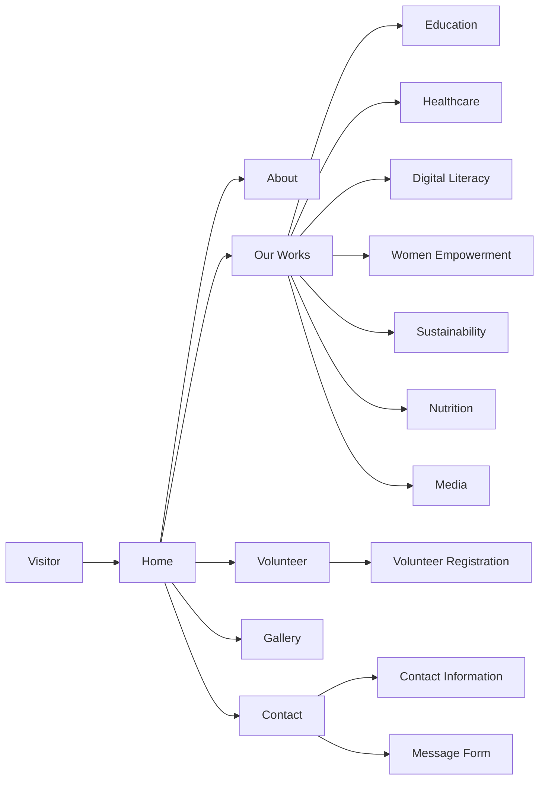
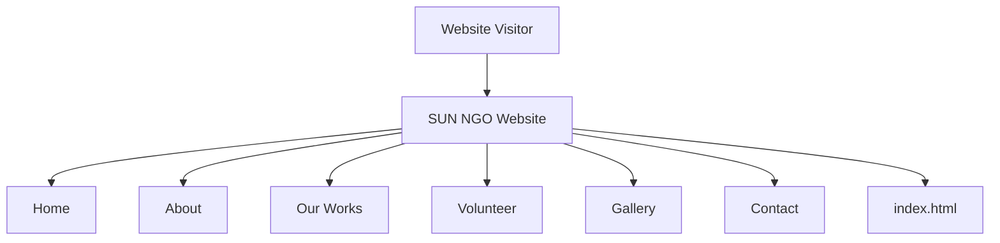
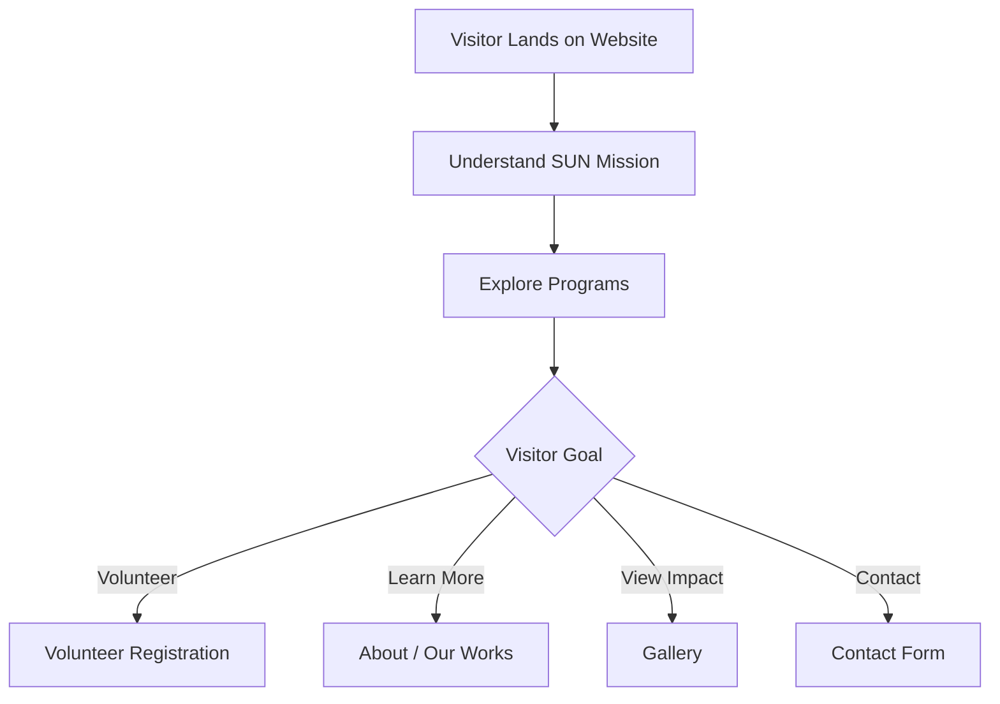

# 🌱 SUN NGO Website — Student Union for Nation

A modern, responsive NGO website created for **Student Union for Nation (SUN)** to present its mission, community programs, volunteer opportunities, impact, gallery, and contact information through a clean digital experience.

## 🌐 Live Website

**Live Demo:** https://sun-ngo-website.vercel.app/

**GitHub Repository:** https://github.com/Naveenbabu45/SUN-NGO-Website

---

## 📌 Project Overview

The SUN NGO Website is a public-facing website for **Student Union for Nation**, an organization focused on empowering communities through education, healthcare, digital literacy, women empowerment, sustainability, and nutrition.

The website brings the organization's major information and activities together in a single web experience, allowing visitors to:

- Learn about SUN and its mission
- Explore the organization's programs
- View community-impact highlights
- Explore the photo gallery
- Register as volunteers
- Contact the organization
- Discover ways to participate and support the mission

---

## 🎯 Project Goals

The website was designed to:

- Build a professional digital presence for the organization.
- Clearly communicate SUN's mission and activities.
- Showcase community programs and impact.
- Encourage volunteer participation.
- Provide accessible contact and enquiry sections.
- Present information through a clean, modern, responsive interface.

---

## ✨ Key Features

### 🏠 Home

The landing section introduces the organization with a clear mission statement and calls to action for visitors to join as volunteers or explore the organization's work.

### ℹ️ About

The website presents the organization's background, purpose, and major focus areas.

### 🌍 Our Works

Programs are presented as dedicated initiatives covering areas such as:

- 🍽️ Nutrition
- ❤️ Healthcare
- 💻 Digital Literacy
- 👑 Women Empowerment
- 🌱 Sustainability
- 📚 Education
- 🎬 Media

### 🤝 Volunteer Registration

Visitors can register their interest in volunteering by providing:

- First name
- Last name
- Email
- Phone number
- City / State
- Area of interest
- Personal introduction

### 🖼️ Gallery

The gallery presents moments from community programs, workshops, outreach activities, health camps, education initiatives, and other events.

### 📬 Contact

The website provides contact information and a message form for visitors who want to reach the organization.

---

## 🧭 Website Structure



---

## 🏗️ High-Level Architecture

The current GitHub repository contains a single `index.html` file, making this project a lightweight static website implementation.



---

## 🧩 Program Highlights

### 🍽️ Feeding Hands

A nutrition-focused initiative supporting underprivileged children and families through meal programs.

### ❤️ Life Saviours

A healthcare initiative focused on providing medical assistance and improving access to healthcare services.

### 💻 Tech Saala

A digital-literacy initiative focused on helping rural youth develop technology skills.

### 👑 Elite Queens

A women-empowerment initiative centered around skill development and entrepreneurship.

### 🎬 Visual Vibes

A media initiative focused on creating visual content to communicate the organization's work and reach wider communities.

### 📚 Guiding Lights

An education-focused initiative providing learning support and mentorship.

---

## 🛠️ Technology

The current repository is implemented as a lightweight static web project.

### Confirmed Repository Structure

```text
SUN-NGO-Website/
│
├── index.html
│
└── README.md
```

### Technology Category

- HTML
- Responsive web design
- Static web deployment
- Vercel

> The repository currently contains `index.html` as its source file. Additional technologies should only be listed if they are added to the repository implementation.

---

## 🚀 Deployment

The website is deployed and publicly accessible through Vercel.

```text
Source Code
     │
     ▼
GitHub Repository
     │
     ▼
Vercel Deployment
     │
     ▼
Live SUN NGO Website
```

**Live:** https://sun-ngo-website.vercel.app/

---

## 📱 User Experience

The website is organized around a simple visitor journey:



---

## 📸 Screenshots

Recommended screenshots to add to this README:

### 🏠 Home Page

_Add homepage screenshot here._

### 🌍 Our Works

_Add programs section screenshot here._

### 🤝 Volunteer Registration

_Add volunteer section screenshot here._

### 🖼️ Gallery

_Add gallery screenshot here._

### 📬 Contact

_Add contact section screenshot here._

---

## 💡 Project Highlights

- 🌱 Real-world NGO website
- 🎨 Modern public-facing design
- 📱 Responsive web experience
- 🌍 Community-focused content
- 🤝 Volunteer engagement section
- 🖼️ Impact gallery
- 📬 Contact and enquiry section
- 🚀 Live Vercel deployment
- 💻 Lightweight static implementation

---

## 📈 Future Enhancements

Potential future improvements include:

- Volunteer registration backend
- Admin dashboard for managing registrations
- Dynamic event management
- Donation/payment integration
- Newsletter subscription
- CMS-based content management
- Dynamic gallery management
- Volunteer authentication
- Contact form backend integration
- Analytics dashboard
- SEO improvements
- Accessibility enhancements

---

## 🎓 Learning Outcomes

This project provides practical experience in:

- Designing a real-world website
- Structuring a multi-section web interface
- Creating responsive layouts
- Presenting organizational information effectively
- Designing user-focused navigation
- Deploying a website to a public hosting platform
- Maintaining a production-facing GitHub repository

---

## 👨‍💻 Author

**Naveen Babu**

Computer Science & Engineering Student  
Full-Stack Development | Java | Data Structures & Algorithms

### Connect

- LinkedIn: https://www.linkedin.com/in/kommmavarapunaveenbabu
- Portfolio: https://naveen-portfolio-swart-rho.vercel.app/
- GitHub: https://github.com/Naveenbabu45

---

## ⭐ Project Status

**Status:** Live & Deployed 🚀

The website is publicly accessible and the repository is maintained as part of the author's development portfolio.

---

<p align="center">
  <b>Student Union for Nation — Empowering Communities Through Action 🌱</b>
</p>
